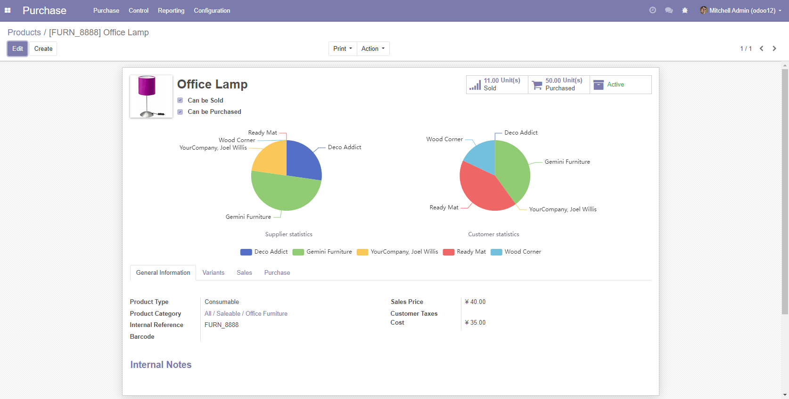
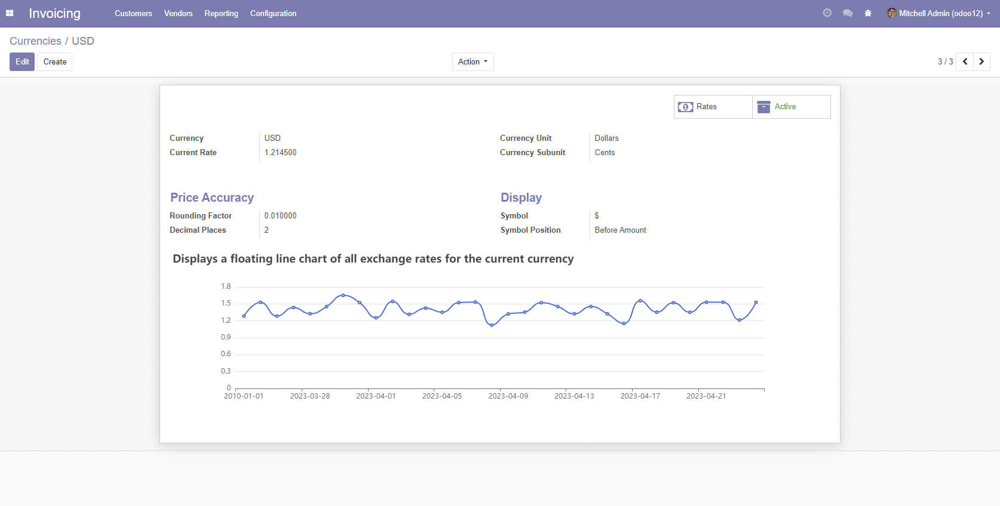

# Display echarts in Odoo's form view

## Screenshots




## How To Use?

### Add a calculated field to the model and return the JSON format

```python 
# model.py
_inherit = 'modelName'

chart = fields.Char(string='Exchange rate chart', compute='_compute_chart')

def _compute_chart(self):
    # You can query internal and external data sources through Odoo's ORM methods, SQL statements, etc., and then return data in JSON format
    option = {
        'xAxis': {
            'type': 'category',
            'data': ['2010-01-01', '2023-03-25', '2023-03-26', '2023-03-27',
                     '2023-03-28', '2023-03-29', '2023-03-30', '2023-03-31',
                     '2023-04-01', '2023-04-02', '2023-04-03', '2023-04-04',
                     '2023-04-05', '2023-04-06', '2023-04-07', '2023-04-08',
                     '2023-04-09', '2023-04-10', '2023-04-11', '2023-04-12',
                     '2023-04-13', '2023-04-14', '2023-04-15', '2023-04-16',
                     '2023-04-17', '2023-04-18', '2023-04-19', '2023-04-20',
                     '2023-04-21', '2023-04-22', '2023-04-23', '2023-06-06']},
        'yAxis': {
            'type': 'value'},
        'series': [
            {'data': [1.2834, 1.5289, 1.2834, 1.4365, 1.3256, 1.4526, 1.6523, 1.5234,
                      1.2548, 1.5434, 1.3154, 1.4253, 1.3521, 1.5234,
                      1.5321, 1.1235, 1.3215, 1.3543, 1.5214, 1.4531,
                      1.3245, 1.4531, 1.3245, 1.1532, 1.5563, 1.3541,
                      1.5213, 1.3515, 1.5312, 1.5313, 1.2145, 1.5289],
             'type': 'line',
             'smooth': True}]}
    options = json.dumps(option).replace('True', 'true').replace('False', 'false')
    self.chart = options

```

### Add calculated fields to the Form view, using the echarts widget

```xml 
<script type="text/javascript" src="/module_name/static/src/js/chart.js"/>
<field name="chart" widget="echarts" style="height:300px;"/>
```
> Notes: You can set the height of the echarts chart via the style property.

### Support javascript via `<script>` tag

The echarts setOption attribute can be supplemented /module_name/static/src/js/chart.js

```js
if ($('div[name="chart"]>div').length > 0) {
    let chart = echarts.getInstanceByDom($('div[name="chart"]>div')[0])
    chart.setOption(
        {
            title: {
                text: 'Displays a floating line chart of all exchange rates for the current currency'
            },
            tooltip: {
                trigger: 'axis'
            },
        }
    )
}
```

### All options of the chart after combining calculated fields with JavaScript are set as follows:

```json
let option = {
    title: {
        text: 'Displays a floating line chart of all exchange rates for the current currency'
    },
    tooltip: {
        trigger: 'axis'
    },
    xAxis: {
        type: 'category',
        data: ['2010-01-01', '2023-03-25', '2023-03-26', '2023-03-27',
            '2023-03-28', '2023-03-29', '2023-03-30', '2023-03-31',
            '2023-04-01', '2023-04-02', '2023-04-03', '2023-04-04',
            '2023-04-05', '2023-04-06', '2023-04-07', '2023-04-08',
            '2023-04-09', '2023-04-10', '2023-04-11', '2023-04-12',
            '2023-04-13', '2023-04-14', '2023-04-15', '2023-04-16',
            '2023-04-17', '2023-04-18', '2023-04-19', '2023-04-20',
            '2023-04-21', '2023-04-22', '2023-04-23', '2023-06-06']
    },
    yAxis: {
        type: 'value'
    },
    series: [
        {
            data: [1.2834, 1.5289, 1.2834, 1.4365, 1.3256, 1.4526, 1.6523, 1.5234,
                1.2548, 1.5434, 1.3154, 1.4253, 1.3521, 1.5234,
                1.5321, 1.1235, 1.3215, 1.3543, 1.5214, 1.4531,
                1.3245, 1.4531, 1.3245, 1.1532, 1.5563, 1.3541,
                1.5213, 1.3515, 1.5312, 1.5313, 1.2145, 1.5289],
            type: 'line',
            smooth: true
        }]
}
```

## ECharts documentation reference
https://echarts.apache.org/en/index.html

## Associative modules
* exchange_rate_chart
* product_form_chart


## Any question? please contact us
 * Email: <a href="mailto:it@yumtown.com.cn">it@yumtown.com.cn</a>
 * Website: <a href ="https://www.yumtown.cn/">SHANGHAI YUM TOWN FOOD CO., LTD.</a>
